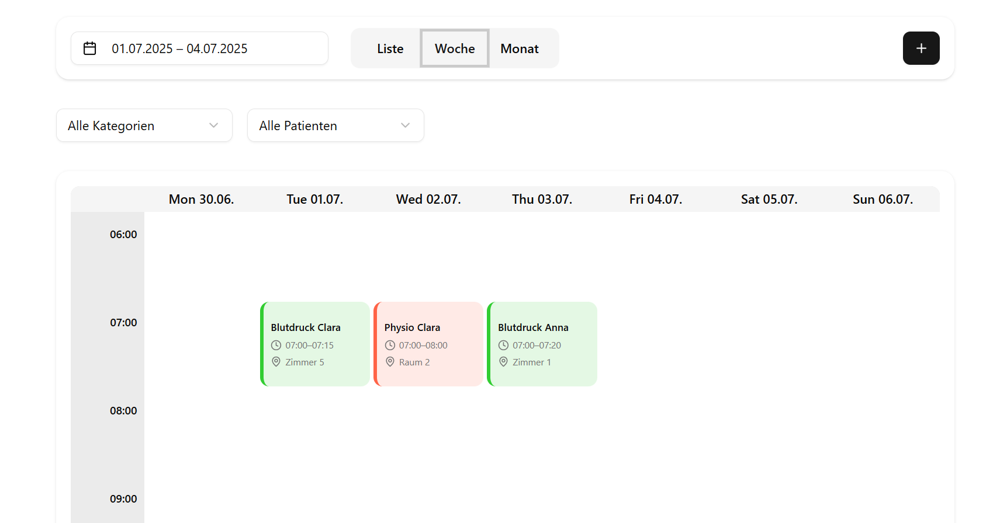

# Appointment Scheduler

A full stack prototype for managing patient appointments in calendar and list views.

**[View live demo](https://scheduling-protoype.vercel.app/)**



It's built with **Next.js, TypeScript, Supabase, TanStack Query, and Tailwind CSS**. You can create, edit, delete, view, and filter appointments, and the calendar state is kept in the URL.

## Features

* Month, week, and list views for appointments
* Create, edit, and delete appointments
* Filter appointments by patient and category
* Filter by a custom date range
* Colours based on appointment category
* Appointment details for time, location, notes, patient, and category
* Hover previews so you can inspect an appointment quickly
* Appointment editing in a responsive dialog

## Engineering highlights

* **Validated mutations on the server**
  Appointment creation and updates go through Next.js API routes. Zod checks ISO datetimes and UUID references before anything is written to Supabase.
  [`POST route`](src/app/api/appointments/route.ts) · [`PATCH / DELETE route`](src/app/api/appointments/%5Bid%5D/route.ts)

* **Reads in the browser and privileged writes stay separate**
  Reads in the browser use the public Supabase client. Mutations use a separate server client configured with the service role key.
  [`supabaseClient.ts`](src/lib/supabaseClient.ts) · [`supabaseAdmin.ts`](src/lib/supabaseAdmin.ts)

* **Calendar queries follow the visible range**
  The calendar works out the visible ISO week, or the six week span used by the month view, then fetches only appointments in that window.
  [`useCalendarRange.ts`](src/hooks/useCalendarRange.ts) · [`MonthView.tsx`](src/components/calendar/MonthView.tsx) · [`WeekView.tsx`](src/components/calendar/WeekView.tsx)

* **Relational Supabase queries**
  Appointment reads also fetch the related category and patient in the same query, then map that into the app's typed appointment model. You can filter by date range, category, and patient.
  [`useAppointments.ts`](src/hooks/useAppointments.ts) · [`appointments.ts`](src/types/appointments.ts)

* **Application state lives in the URL**
  Calendar view, date range, category, and patient filters are stored as query parameters, so a reload keeps the same view and filters.
  [`page.tsx`](src/app/page.tsx) · [`AppointmentFilter.tsx`](src/components/appointments/AppointmentFilter.tsx) · [`DateRangeFilter.tsx`](src/components/appointments/DateRangeFilter.tsx)

* **Cached reference data**
  Categories and patients load through TanStack Query and share a query client at the app root.
  [`useMeta.ts`](src/hooks/useMeta.ts) · [`ReactQueryProvider.tsx`](src/components/providers/ReactQueryProvider.tsx)

## Architecture

```text
Browser
│
├── Calendar / list UI
│   ├── MonthView
│   ├── WeekView
│   └── AppointmentList
│
├── React hooks
│   ├── useAppointments
│   ├── useCalendarRange
│   └── useMeta
│
├── Supabase browser client
│   └── Appointment and metadata reads
│
└── Next.js API routes
    ├── POST   /api/appointments
    ├── PATCH  /api/appointments/:id
    └── DELETE /api/appointments/:id
          │
          └── Supabase server-side client
```

## Tech stack

* **Next.js 15 / React 19**
* **TypeScript**
* **Supabase**
* **TanStack Query**
* **Zod**
* **Day.js**
* **Tailwind CSS**
* **Radix UI**
* **Lucide React**
* **React Day Picker**

## Getting started

Clone the repository and install the dependencies:

```bash
git clone https://github.com/Tunc0x/appointment-scheduler.git
cd appointment-scheduler
npm install
```

Create a `.env.local` file in the repository root:

```env
NEXT_PUBLIC_SUPABASE_URL=your_supabase_url
NEXT_PUBLIC_SUPABASE_ANON=your_supabase_anon_key

SUPABASE_URL=your_supabase_url
SUPABASE_SERVICE_ROLE_KEY=your_service_role_key
```

Start the development server:

```bash
npm run dev
```

Open `http://localhost:3000`.

### Supabase data expected by the app

The app expects three tables:

* `appointments` — appointment time, title, location, notes, category, and patient references
* `categories` — category label and colour
* `patients` — patient first and last name

The schema and migrations aren't versioned in this repo yet, so you'll need an existing compatible Supabase schema for local development.

## Project structure

```text
appointment-scheduler/
├── public/                         # Static assets
├── src/
│   ├── app/
│   │   ├── api/
│   │   │   └── appointments/      # Appointment mutation API
│   │   ├── layout.tsx
│   │   └── page.tsx
│   │
│   ├── components/
│   │   ├── appointments/          # Forms, lists and filters
│   │   ├── calendar/              # Month/week calendar UI
│   │   ├── providers/             # React Query provider
│   │   └── ui/                    # Reusable UI primitives
│   │
│   ├── hooks/                     # Data and calendar hooks
│   ├── lib/                       # Supabase and date utilities
│   └── types/                     # Application data types
│
├── package.json
├── next.config.mjs
├── tsconfig.json
└── README.md
```

## Current scope

This repo is a scheduling prototype. It's about appointment workflows and the frontend and data access architecture behind them. Think of it as a demonstration project, not a production scheduling platform.
